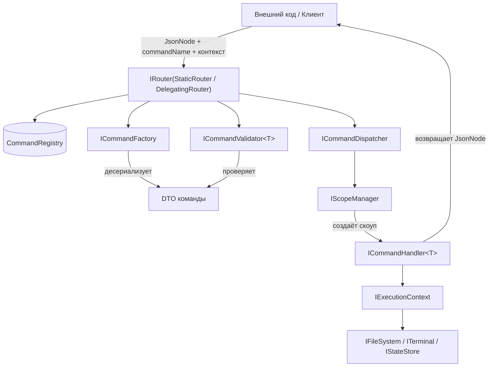

1. Базовые типы и форматы
ICommand — маркерный интерфейс для DTO команд. Сам по себе не содержит свойств, служит для идентификации.

JsonNode — универсальный тип из System.Text.Json.Nodes, представляющий структурированные данные (объект, массив, строка, число, null). Используется для:

Входных аргументов команд (передаётся в IRouter.RouteAsync).

Выходных результатов хендлеров.

DTO команд — это record-классы, реализующие ICommand. Они содержат типизированные свойства (например, string Path, bool Recursive). Входной JsonNode десериализуется фабрикой в конкретный DTO.

IExecutionContext — контейнер для сервисов окружения (IFileSystem, ITerminal, IStateStore и опциональных). Имеет имя (Name) и может предоставлять дополнительные сервисы через GetService<T>().

IContextRegistry — реестр, хранящий предопределённые контексты по строковому ключу. Позволяет устанавливать и получать контекст по умолчанию.

2. Регистрация команд
CommandAttribute — применяется к классу хендлера. Содержит:

Name (обязательно)

Description (опционально)

Category (битовые флаги, например, FileSystem, Terminal, VoiceUI, Internal)

RequiresConfirmation

Example

CommandRegistry — сканирует сборки, находит все классы с атрибутом, определяет реализуемый ими интерфейс ICommandHandler<TCommand>, извлекает TCommand (тип DTO), собирает правила валидации из атрибутов свойств DTO (ValidationAttribute). Хранит записи CommandEntry в словарях по имени и по типу DTO.

CommandEntry — record с полями:

CommandType, HandlerType, Name, Description, RequiresConfirmation, Category (флаги), ValidationRules, Example.

3. Создание команды (фабрика)
ICommandFactory — интерфейс с методом ICommand? Create(CommandEntry entry, JsonNode? argument, out string? error).

Реализация CommandFactory:

Содержит generic-метод CreateCommand<TCommand>, который десериализует JsonNode в TCommand через JsonSerializer.Deserialize.

Метод Create вызывает этот generic-метод через рефлексию (или кешированный делегат) для типа entry.CommandType.

Если аргумент null, передаётся пустой объект new JsonObject().

Возвращает созданный DTO или null с сообщением об ошибке.

Фабрика не использует внутреннего кеша — кеширование вызовов возложено на роутер.

4. Валидация команд
ICommandValidator<TCommand> — интерфейс с методом bool TryValidate(TCommand command, out string? error).

DataAnnotationsValidator<TCommand> — реализация по умолчанию:

В конструкторе получает CommandRegistry и извлекает ValidationRules для TCommand.

В TryValidate проверяет каждое свойство DTO на соответствие атрибутам ValidationAttribute.

Возвращает false и сообщение об ошибке, если хотя бы одно правило нарушено.

Валидатор регистрируется в DI как открытый generic (ICommandValidator<> → DataAnnotationsValidator<>).

При необходимости для конкретной команды можно зарегистрировать собственную реализацию ICommandValidator<TCommand>.

5. Управление скоупами
IScopeManager — метод Task<T> RunInScopeAsync<T>(Func<IServiceProvider, Task<T>> action).

ScopeManager — реализация, зависящая от IServiceScopeFactory. Создаёт AsyncServiceScope, выполняет action и уничтожает scope.

6. Диспетчер команд
ICommandDispatcher — метод Task<JsonNode> SendAsync<TCommand>(TCommand command, IExecutionContext? context = null, CancellationToken cancellationToken = default), где TCommand : ICommand.

CommandDispatcher:

Зависит от IScopeManager.

Внутри вызывает _scopeManager.RunInScopeAsync, где получает ICommandHandler<TCommand> из IServiceProvider и вызывает HandleAsync, передавая ему контекст (если он был передан).

7. Хендлер команд
ICommandHandler<in TCommand> — метод Task<JsonNode> HandleAsync(TCommand command, IExecutionContext? context = null, CancellationToken cancellationToken = default).

Конкретные хендлеры:

Помечены атрибутом [Command].

Реализуют ICommandHandler<TCommand>.

В конструкторе получают глобальные зависимости (например, ILogger), но сервисы окружения получают через контекст (передаваемый параметром).

Используют context.FileSystem, context.Terminal, context.StateStore и т.д. для выполнения бизнес-логики.

8. Роутинг (статический и делегирующий)
IRouter — метод Task<JsonNode> RouteAsync(string commandName, JsonNode? argument, IExecutionContext? context = null, CancellationToken cancellationToken = default).

StaticRouter:

Зависит от CommandRegistry, ICommandFactory, ICommandDispatcher, IContextRegistry.

Алгоритм:

Получает CommandEntry по имени.
Если контекст не передан, получает дефолтный контекст из IContextRegistry.
Создаёт DTO через фабрику.
Получает валидатор (через DI и кеширование делегатов) и вызывает TryValidate.
Вызывает диспетчер SendAsync, передавая контекст и команду.
Кеширует делегаты для вызова валидатора и диспетчера по типу команды.

DelegatingRouter — абстрактный базовый класс для роутеров-обёрток:

Принимает IRouter innerRouter и IContextRegistry в конструкторе.

Реализует RouteAsync, делегируя вызов внутреннему роутеру (с подстановкой дефолтного контекста, если не передан).

Наследники могут переопределить RouteAsync для добавления своей логики (например, IntentRouter классифицирует фразу, а затем вызывает base.RouteAsync).

MushiRouter — композитный роутер, принимает список IRouter и последовательно вызывает их до первого успеха.

RemoteRouter — отправляет команды по сети, если не удаётся — делегирует внутреннему роутеру.

9. Контексты и реестр
IContextRegistry — синглтон, хранит словарь контекстов. Методы:

IExecutionContext GetContext(string name) — возвращает контекст по имени, если не найден — дефолтный.

void RegisterContext(string name, IExecutionContext context).

void SetDefaultContext(IExecutionContext context) и void SetDefaultContext(string contextName) — устанавливают дефолтный контекст (по экземпляру или по имени).

IExecutionContext GetDefaultContext() — возвращает дефолтный контекст.

Реализация ContextRegistry выбрасывает исключение, если дефолтный контекст не установлен.

BaseExecutionContext — абстрактный базовый класс, хранит имя и словарь дополнительных сервисов. Конкретные контексты переопределяют свойства FileSystem, Terminal, StateStore.

10. Взаимодействие с Shimi (адаптеры)
Интерфейсы окружения определены в Shimi.Abstractions:

IFileSystem — базовый (байтовые операции): ReadBytesAsync, WriteBytesAsync, ExistsAsync, GetTreeAsync.

ITextFileSystem — расширяет IFileSystem: ReadTextAsync, WriteTextAsync, AppendTextAsync с параметром Encoding.

IJsonFileSystem — расширяет IFileSystem: ReadJsonAsync<T>, WriteJsonAsync<T> с параметрами JsonSerializerOptions.

ITerminal — RunCommandAsync.

IStateStore — GetAsync<T>, SetAsync<T>, RemoveAsync.

ITelemetryLogger — LogEvent, LogError.

Конкретные адаптеры (ConsoleFileSystem, ConsoleTerminal) поставляются в Kouki.Ubusuna и регистрируются через метод расширения AddUbusuna.

11. Поток выполнения (полный цикл)

1. **Вход** — внешний код вызывает `IRouter.RouteAsync(commandName, argument, context?)`.
2. **Роутер** (например, `StaticRouter`) получает `CommandEntry` из `CommandRegistry`.
3. **Фабрика** создаёт DTO команды из `JsonNode` (через generic-метод `CreateCommand<TCommand>`).
4. **Валидатор** (если зарегистрирован) проверяет DTO; при ошибке возвращается `JsonNode` с ошибкой.
5. **Диспетчер** создаёт скоуп через `ScopeManager`, получает хендлер из DI и вызывает `HandleAsync`.
6. **Хендлер** выполняет бизнес-логику, используя сервисы из контекста (`IFileSystem`, `ITerminal`, `IStateStore`).
7. **Результат** (JsonNode) возвращается обратно вызывающему коду.

---

12. Расширение роутинга (IntentRouter)
IntentRouter (внешняя реализация) переопределяет RouteAsync:

Принимает commandName как голосовую фразу.

Классифицирует интент (через каскад ML.NET → BERT → LLM).

Извлекает слоты (аргументы).

Формирует JsonNode с аргументами и вызывает base.RouteAsync с именем команды и аргументами.

При необходимости выбирает контекст на основе распознанного слота.

13. Логирование и телеметрия
ITelemetryLogger используется в роутерах, диспетчере и хендлерах для логирования событий, ошибок и метрик. Например:

Успешные/неудачные выполнения команд.

Отказы интентов (для дообучения моделей).

Долгие вызовы.

14. Примечания
Все асинхронные методы поддерживают CancellationToken.

Входной аргумент всегда передаётся как JsonNode (может быть null, но нормализуется в пустой объект фабрикой).

Выход команды — JsonNode, что позволяет возвращать простые типы (string, int) или сложные объекты.

Жизненный цикл: Registry, Factory, Dispatcher, Router, ScopeManager, ContextRegistry — синглтоны; хендлеры и валидаторы — Scoped (создаются на каждый вызов команды).

Контекст (IExecutionContext) не является DI-сервисом и не привязан к скоупу; он передаётся явно как параметр.

Для повышения производительности StaticRouter кеширует делегаты вызова валидатора и диспетчера по типу команды.

Генерация кода (Source Generators) планируется для автоматической регистрации команд и валидаторов, что позволит отказаться от рефлексии в рантайме.